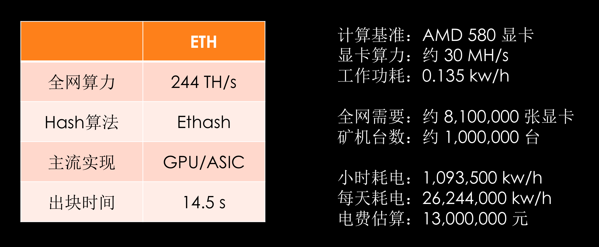

# 区块链技术的效率以及未来

## 0. 缘起
  在一个夏日的下午，我（Tim）和Larry两人坐在咖啡馆里海阔天空的讨论区块链技术。我们发现讨论的焦点就在于区块链的效率。这种对于效率的考量，主要是与现有基于中心化云计算模式构建的标准互联网架构进行对比。进一步深入下去，我们觉得这是一种去伪存真的过程，会影响到未来区块链和数字资产技术应用落地的发展。

  与区块链行业火热不同的是，作为一个普通的用户，似乎除了比特币、以太坊钱包之外，依然用不到什么真正基于区块链的产品。为此，区块链为普通用户到底能带来什么？这是值得我们所有人去深刻反思的。也许，我们未必需要用传统互联网产品的高标准去要求这些分布式新技术。然而，面向未来可能出现的各种技术融合的可能，与传统方法和技术的对比，有利于我们梳理清楚这些新兴技术的性能特点与发展趋势。

## 1. 问题与挑战

### 1.1 区块链技术真的有效率吗？

  区块链是一种区别于传统集中化分布式计算构架的技术。该技术反其道而行之，采用了点对点的网络通讯模式，通过冗余的区块链数据存储模式和共识计算过程，去除了物理上的中心化。这种技术确实带来了焕然一新的网络结构模式，

  但是，另一方面，区块链的架构模式，让人们对其实际应用中的效率产生了疑问： 区块链的存储和计算，会有多个节点来做重复的存储和计算，会不会效率较低并且费用昂贵？特别是与中心化分布式计算技术比较，可以看到，去中心化的方案千好万好，最不好的一点就是：不经济和低效。目前，在以太坊及之后的一些区块链里，秒级成交已经成为了宣传点之一。为此我们就具体的情况从网络，账本存储，共识算法，智能合约等效率维度进行对比，提出挑战，引发思考，从而与业界同仁一起去追寻更好的答案。

  为了便于进行实际的横向对比，我们取2018年8月15日的主流区块链运行数据做一个比较。在下文中，我们选取了目前区块链中最主流的比特币（BTC）和以太坊（ETH），有较长历史的莱特币（LTC），以及新近得到普遍关注的加密币种达世币（DASH）等4个区块链公链项目，进行了专门的比较。

#### 1.1.1 典型区块链的计算效率

  2018年8月15日这一天，这四种公链基本的算力相关数据如下表所示。

|    公链    |     BTC     |    LTC    |   ETH      |  DASH        |
| --------- |:-----------:|:---------:|:----------:|:------------:|
|  全网算力   |  48.06 EH/s |  251 TH/s | 244 TH/s   |  1.538 PH/s  |
|  Hash算法  |  SHA-256    |  Scrypt   |  Ethash    |   X11        |
|  主流实现   |  ASIC       |   ASIC    |  GPU/ASIC  |  GPU/ASIC    |
|  出块间隔   |  606 s      |  152 s    |  14.5 s    |  156 s       |

  该表中，“H/s”表示每秒钟hash函数的计算次数，前缀“T”表示10的9次方（即10亿），“P”表示10的12次方（即1万亿），”E“表示10的15次方（即1千万亿）。所以，基本看到为了维持整个公链的共识计算效果，各个公链的计算都是非常惊人。

  然而，由于各种公链往往采用各自不同的共识计算方法，进而会采用不同的hash计算方法，表面上难以直接横向比较各个公链的计算效率。所以，有一个变通的方法是估算在同一类硬件中的执行效率，从而有直观的对比。例如，以ETH为例，我们可以假设全网采用了较为优化的AMD 580系列显卡。以此为基准，我们可以进行一个大概的估算。由各个数据来源报告所知，该显卡的实际计算能力为30 MH/s，即每秒钟计算“Ethash”的hash函数约3千万次，实际消耗功率为 0.135 KW/h（即用电单位"度"）。为此，简单可以估算出ETH全网约需要8,100,000张显卡。而主流的ETH矿机为8块显卡的配置，所以估计需要约 1,000,000台的以太坊显卡矿机。进一步估计出，ETH公链的小时耗电数为，1,093,500 KW/h，而每天（即24小时）需要耗电 26,244,000 KW/h，来维持全网的运行。大致按照每度电0.5元的费用核算，每天需要的电费成本估算为13,122,000元，即每天千万元级别以上的成本。而一整年更将耗资47.9亿元之巨。从中可以看出，要维持区块链的公链系统———这种去中心化互联网的公共设施，消耗惊人。

  

  从公链系统所需投入的设备成本考虑，目前以太坊主流显卡矿机，包含8块显卡，其成本大约为2.5万元。那么，据此估算总共的网络需要250亿元的设备投入。按照三年折旧来换算，估计为83亿元的每年费用。如果不考虑网络带宽成本，那么进一步可以推算，一年的以太坊公链系统整体维护成本在131亿元。因此可知，目前公链的实际维护成本非常高。

  据 https://etherscan.io/ 数据统计，从2017年9月1日至2018年9月1日，总共发生了约2.5亿笔交易。所以根据上述年度成本折算，则平均每笔交易的成本在52元。与目前银行转账的费用相比，没有任何优势。就国内银行的普遍情况看，各行的柜台转账，普遍按照汇款金额的0.5%至1%收取手续费，50元封顶。而网银和手机转账是免费的。因而，除非是高于5000元以上的大额度转账，用区块链进行小额度转账有点的得不偿失。当然，在某些特殊情况下，例如跨境跨行的数字货币转账，由于不需要跨各国银行系统进行复杂的兑换和结算，区块链方案的成本和转账时间会优于传统方案。

  另一方面，以全年2.5亿笔的交易量推算，以太坊网络平均每秒钟约执行8笔左右的交易，即8TPS。在基于工作量证明的去中心化方案中，近百万台矿机仅是在为了获得记账权，就消耗了大量的电力，并没有对记账本身带来多大帮助。而上万台全帐节点也是在任一时刻，只有一个节点在记账。对比传统的中心化解决方案，要达到10TPS左右的交易量，用一台中等性能的服务器即可做到，其成本约为每年1万元。最后换算成交易成本，仅为0.000013元，这是值得深思的数字。

  与此相关的是，矿工费太贵。如果你要让一笔以太坊交易成立，是需要花费一定的矿工费的。所谓矿工费，对于以太坊公链来说，就是指交易发起者需要燃烧一定的燃料Gas，但是Gas的费用是用以太坊结算，用于奖励那些主动传播这笔交易的人。而如果你想要在以太坊上实现“秒级信息传递”，高额的矿工费自然是少不了的。例如，据最近区块链浏览器应用 https://etherscan.io/txs 中的数据，每笔普通速率的以太坊公链交易矿工费大约在0.0005ETH左右。按照目前1个ETH兑换约1200元（2018年9月初的价格）换算，即0.6元左右。所以与目前银行转账的费率相比，并没有太大的优势。因为大多数小额的银行转账是免费的。如果想做到高速转账，每笔会上涨到0.003ETH左右，即3.6元左右，甚至更高。

  幸运的是，目前以太坊等数字货币价格在历史的低位，所以转账费率相对便宜。但在牛市行情下，交易火爆时，以太坊的交易费率也会水涨船高。例如，2018年初以太坊曾上涨到1个ETH兑换约10000元左右。那么在那时，以人民币作为结算单位，交易费率是现在费率的10倍，远远高于目前中心化的解决方案。

#### 1.1.2 网络传输的效率

目前，在以太坊及之后的一些区块链里，秒级成交已经成为了宣传点之一。但“能做到”和“做到要多少成本”不是一个概念。网络延时也是一个大问题，因为P2P网络不存在一个稳定的中转服务器，因此每次发送信息都是通过多个作为用户的节点中转送达，在信息传递上很难满足即时传输。假如，我们试图传播专题文章类型的文字内容，则所需的同步速度可以很慢。用户可能发布之后几个小时后，才会被人看到。然而，假如我们是要实现微博、微信这种需要高频信息发布和接收的dApp时，就会出现一些严重问题。一个首要问题是：时间线错乱，或者说数据异步。一条微博下面的评论经常出现前后时间线错乱。这就是因为评论者发布的时间虽然早，但同步的时间慢，而后来者已经根据他之前的回复进一步展开了讨论导致的。

若用以太坊的公链作为观察对象，全网大约有10000台左右的全量节点机器。如果以每次每台机器向10个节点同步数据，估计在4次跳转后可完成全网同步。以太坊现在的平均区块大小在网络传输 22KB左右。按照每次同步时间500ms计算，估计的同步时间在2秒以内完成。据此，整个网络的同步通讯工作，干得并不坏。但是，对于实际所需大吞吐量的交易场景来说，还是显得过于低效。由前可知，实际上以太坊的公链是在处理每秒10笔左右的交易，本来中心化方案大可以简化为数台中等性能的机器，即能完成同样的业务。

在例如比特币的公链网络实际运转过程中，可以测算出，1KB长度的消息，在1秒内完成95%的传播。而1MB长度的消息，则需要1.5分钟，才能完成95%的传播。所以，从实际交易能力来看，当采用较大尺寸的区块时，网络传输效率下降非常快。

#### 1.1.3 外部存储的效率与冗余问题

在传统互联网模式下，比如 Google 要保障一个视频永久在线并被所有人都能看到，可能只需要留存一份视频，实际底层云存储实现情况来看可视为有3个左右备份。而对于区块链应用的用户来说，每个用户既是使用者，又是存储和带宽的贡献者。这意味着抬高了普通用户使用分布式应用的门槛。理论上，如果有一个精妙的算法，可以动态调节出全网的可靠存储量和总带宽。而实际上，现在的区块链应用都比较粗糙，它视每一个用户均为全量备份节点。因此，在这种模式下，全网的存储能力，与算力的情况相似，仅为一台机器的能力。如果直接用“链上”方案直接存储媒体数据，几乎不可能承载大型视频网站，而这一问题其实也困扰着几乎所有的区块链分布式应用。

目前以太坊是已知具有最大的全量区块数据的项目，因为其上需要运转诸多智能合约以及由此衍生出来的各种代币（Token），但是该项目也仅为不到700GB的全量数据。而比特币的区块链网络，更是不到300GB的全量数据。但是由于区块链的去中心化核心策略，以及安全性诉求，导致了数以千计的节点需要存储全量数据，从而造成了极大的数据冗余。对比中心化数据库的解决方案，该级别的存储业务，面向10TPS的业务负载，仅需要一台普通配置的云计算服务器，即可提供同等质量的数据服务。对比去中性化方案，存储成本可极大节约。而且即使考虑数据存储的鲁棒性，在既有的中心化架构中，我们有基于RAID阵列技术的NAS或者SAN、基于分布式廉价冗余架构的云存储以及基于内存的高速存储等各类方案可供选择。相较于需要全局拷贝，这些方案的执行成本都是非常低的。当然，我们相信，后续的区块链技术发展必然会向既有的云计算技术学习其中可取成分，从而提升其去中心化方案的服务能力。

#### 1.1.4 dApp和智能合约的效率

从以上的特性可以推导出的一件事是：基于公链的移动端应用不好做。
首先，是技术层面的困难。移动端计算性能和存储空间受限，对于任何 dApp 来说都难以在移动端上跑公链的全量节点。因此，如果预期 dApp 的主要应用场景是在移动端，那么会面临网络贡献量与使用量不匹配的问题。

其次，是政策方面的困难。无论在任何一个国家和地区，拥有移动市场半壁江山的苹果，都遵循需要有一个应用开发者来承担应用可能带来的侵权风险的原则。这导致一些基于社区开发的开源项目，无法登陆苹果 App Store，因为事实上没有人可以为应用中的内容负责。这种冲突，有点类似于实体经济中的共享经济，共享经济瓦解了酒店集团、出租车公司的利益，同时分散了他们的责任。一旦出现事故，难以确定责任主体，也就无从谈及追责和赔偿。

其三，「不可篡改」=「无法消错」。我们早前经常听说区块链是「不可回滚」的，后来我们又听说很多区块链社区投票一致实现了「集体回滚」。区块链本质上是一种数据库技术，在当今的大部分认知中，区块链被认为是一种「先进」的数据库技术。然而事实上，区块链却是一种天生瘸腿的数据库技术。在数据库最基础的四大功能「增删改查」（CURD）中，区块链只能实现增和查两项。这在区块链的特性中被体现为「不可篡改性」，而大多数情况下这对于一项数据库技术来说并不是什么好事。在传统数据库中，管理员拥有对数据库进行任意修改的权限，这意味着数据库中的数据出现异常，管理员一个人就可以实现数据的修正。而在区块链中，并没有这个管理员，想要实现数据修正，必须所有用户同意才可以。

为进一步说明这个问题，我们假设有一个顶尖黑客通过漏洞，为自己的 QQ账号增加了 100 万Q币。腾讯技术部门的成员发现了这一问题，只要在数据库中将对应 QQ 的 Q币值改回去就可以了。
而如果此时，Q币是使用区块链存储的，那么麻烦就来了，因为这个黑客修改100万Q币的行为已经发生而且被同步到了每一个用户的手里，那么腾讯不得不发出一个公告「请求」8 亿 QQ 用户共同修改这一事实才能「回滚」。这一问题不仅仅针对数据，而且也是对于智能合约。

另外，dApp在以太坊这些新一代区块链技术中，主要通过智能合约实现。各节点全部不仅要存储全部智能合约，包括绝大多数垃圾合约，而且需要运行同样合约，既浪费存储又浪费算力。

### 1.2 区块链技术能为企业节约信息运维的成本吗？

在企业级应用中，系统的架构设计者会重点考察系统实施所需的成本，以及潜在可带来的回报。为此，我们需要从分布式账本的存储和智能合约的执行成本，结合算力和带宽消耗等因素，来综合考虑。从而评估企业的应用是否适合通过去中性化的模式来加以实施。

#### 1.2.1 成本（TCO）
为便于进行成本的计算，我们将应用场景假定为基于以太坊的公链系统开发和实施。首先，是数据存储的成本。目前以太坊的出快速度平均在15秒左右，而全量区块数据已超过600GB。所以，如果为了提高应用效率和可靠性，并考虑一定的可扩展性，在系统部署全量节点的话，需要至少2T～4T以上的硬盘容量空间专门存放全量数据。如果需要更高的可靠性，可能需要多台机器部署全量同步节点，那么存储方面的预算会持续上升。若考虑到额外的媒体数据，需要进一步采用“链外”存储方案，那么存储成本会进一步上升。

其二，大量的智能合约是需要在节点机器上注入专门的虚拟机执行的。这对于实际节点服务器的运算能力也有很高要求，由于智能合约需要在多台机器上。这进一步提升了硬件购置成本和运维成本。

其三，网络开销和成本。区块数据同步和智能合约执行都需要消耗大量的网络带宽。对于全量节点来说，必须每15秒左右同步一个区块。据估计在整个互联网中，有超过10000台的全量节点，所以因数据同步对于网络造成的压力很大。

其四，现在已知运行较好的公链大多数采用POW共识机制。而这种共识机制的主要缺点在于需要堆积大量的计算硬件用于维持共识机制的可信网络，即使面向企业级应用改成私链，也需要投入额外的共识计算节点，这个会增大计算成本。即使是采用POS和DPOS等基于权益的共识机制，也同样会出现不同程度的浪费。例如，EOS采用21个超级节点作为共识机制的核心，则成本是中心化模式的21倍。而另一方面，如果采用基于PBFT等目前主流私链、联盟链所采用的共识机制话，区块链核心的去中性化信任机制将不能很好地保持，失去了使用区块链技术的核心价值。为此对于面向实际应用的企业应用，需要慎重考量和规划。

我们仍然用以太坊为例，按照目前一个ETH的价格为$209，美元对人民币的汇率在7.0左右来测算, 如果按每年的成本和收入之间的比值计算，网络成本回报比为： 131/(0.0005*209*7.0*2.5)=71.7 . 因此，这意味着大约需要72年才能收回成本，可见通过实际的成本核算方法来观察，区块链项目实际运维成本很高。

#### 1.2.2 回报（ROI）

目前由于大多数的区块链技术还在不断探索过程中，缺少必要的区块链研发人才，所以具体的可落地区块链项目确实不多。而这种现象造成了分布式应用还没有获得广为认可，同时潜在带来投入区块链应用技术的研发，其回报周期将会很长。从短期内看，回报是负。这对于具体的项目决策人员来说，需要根据具体情况作出决策。如果从务实的角度来说，一般建议以中心化方案为主。ROI投入产出比若不成比例，无法让现有的公链继续发展的，则需要进行改变。

一般而言，投资回报率（Return on Investment，缩写为ROI）是企业或者一个运营实体从事商业经营活动或项目时通过投资与以及应返回的价值之间的比值，用于评估所从事项目或者事项的效率和盈利转狂。虽然区块链的公链项目定位于一种公共的互联网设施，而驱动该公链运营的是去中心化的参与者网络，但是仍然可以通过ROI的计算，我们来评估整个系统发展的可持续性。

通常，投资回报率（ROI）= 年利润或年均利润/投资总额 ×100% 。以ETH即以太坊的公链为例，我们假设年度利润的主要来源于是由于ETH挖矿所得。目前三年内共发行了超过了1亿枚ETH，按照当前以太坊兑换人民币的价格是1500元，总共价值为1500亿，所以年均利润约为500亿元。而整个ETH公链网络按照前述估算，三年内投入的硬件成本（约250亿元）和三年电费（约150亿元），共计400亿元的投入。按照这种逻辑，以太坊的ROI约为120%，还是非常不错的项目。

但是，如果我们把利润的来源主要看成是通过收取用户转账的手续费来计算，则一年来的利润总量为2.5亿笔*3.6元/笔=9亿元，与投资总额相比，则ROI将仅为2.25%。通过这两个不同ROI的估算方法，我们可以看到目前区块链公链系统，其主要的价值支撑来自于大家对于ETH币价的共识。一旦这种币价被打压，或者单纯用于企业级应用环境，则投资回报率会迅速下降。因此，关于这个现象是值得具体的系统设计和架构者去深入思考，根据实际情况取舍的。

### 1.3 区块链真的安全方面有效率吗？

#### 1.3.1 存储安全

众所周知，区块链的账本是一部“加密”的账本。存储内容，通过用户公钥加密，私钥解密，安全性得到一定的保证。但这里的加密，并非普通人理解的加密。事实上，我们还经常听说区块链的另一个特性“透明可追溯”。区块链的加密，是指通过加密方式确保参与整个链条的每一个节点都不能超出规则修改，也不能伪造成别人添加信息的一种手段。而大多数的区块链，都遵循透明可追溯的原则，每一个节点都可以看到每一次交易的全部信息（包括交易的双方地址和交易量等），隐私保护能力较弱。

私密内容与分布式存储存在意义上的冲突，换个更简单的例子来说。我们都知道当我们用迅雷下载一部影片的时候，迅雷也会在下载的过程中利用一部分带宽来帮助别人下载，这是一个典型的“你帮我，我也帮他”的模型。但如果你要传输或存储的并非是一个公开文件，而是一个只有你和对方可以看的私密文件，那么第三人为什么要帮你们去“做种”呢？没有私密会带来许多问题，比如聊个天全网都知道了，写个日记也全网都知道了。在金融等很多领域，很多时候是要求实名，但是数据是隐私的。

#### 1.3.2 数据使用

数据使用的问题，则存在比较大的问题（虽然可以有同态加密等），包括用户隐私和监管问题。在已有基于联盟链的应用案例中，有时候这种情况会搞得很复杂。例如，某份交易数据，某两个节点能看到，另外两个节点则不行。我们认为只要是在同一个智能合约里，应该是对等的执行机制，要么信任、要么放弃。在金融应用中，其实还是用传统手段满足“安全、隐私”需求，为区块链隔离复杂性。

对数据安全（完整性既不会倍破坏丢失和私密性即不会泄密）和合规问题（数据不会违法等），包括存储、传输和使用过程的安全保护。同态加密加密可以应用于一些场景并且会有性能影响。

## 2. 可能的解决之道

我们认为一个可行的方向是，与现有中心化的分布式技术相融合，改善并优化公链构造方法。从前述分析来看，虽然区块链代表着一种新兴的信息技术架构方案，然而目前的具体实现还比较粗糙，在效率上和实用性上都有诸多不足，为后续具体应用落地带来了困难。

区块链技术的核心价值，或者说其前提条件，是以数据安全为第一准则，构建了去中心化的共识机制。为此，对于这一目标主要的解决方向是探索更为高效的共识机制，根据实际的应用场合去设计和应用合适的共识核心机制。基本上的可行手段包括：
+ 非工作量证明共识。对于这个方向，目前，例如Algorand算法以及类似“理想共识算法”的提出，都是一种很好的探索。
+ 基于DAG的方案，这类方案适合于在物联网的场景下进行应用，降低了数据同步的需要，提升了数据传输的性能。
+ 节能的工作量证明。事实上比特币和以太坊等区块链项目早期均采用工作量证明有其道理，因为工作量证明往往需要大量的固定硬件设备和持续的能源投入，这是目前看来最具有去中性化能力的信任体系构建方案，具有较强的抗攻击能力。但是此前的方案消耗能源太多，共识算法容易通过ASIC技术实现高度密集的矿池模式，从而带来了反向的中性化效应。为此最近很多人尝试的基于硬盘存储容量的工作量模式值得关注。

另外，在以下的一些方面也值得重视：
+ 面向共识机制，设计更好的激励机制，正向地去改善区块链生态。
+ 面向区块链的可扩展性问题，在保持去中性化的优势之下，所谓分片或者分层技术值得关注。
+ 数据安全性与隐私保护，关注零知识证明，以及更高执行效率的同态加密加密等技术。
+ 分布式存储技术需要结合传统云计算的一些既有经验，例如，采用内存的分布式存储和计算技术。
+ 面向区块链数据传输的专用网络协议的设计和网络硬件设备的开发，是一个值得考虑的方向。
+ 可信计算TEE和多边计算MPC等技术。因为所谓的“不可能三角”是一种静态的思维模式，忽略来自硬件设计、网络协议维度的不断迭代更新和技术发展。

此外，还有一种模式是值得关注的。目前的区块链方案注重于计算模式层面的去中性化，以建立信任的工作体系。然而，从更高的维度考虑，我们可以在各个层面设计去中心化模式，以期找到更具有效率的去中心化方案。例如，我们可否考虑，在组织治理层面采用去中心化，而实际的技术实现路径基本以中心化为主，实现高效率的企业级应用。

## 3. 小结与未来展望
本文就区块链目前遇到的各类问题，进行了分门别类的讨论。我们的目的不是否定区块链技术，而是更好地促进数字资产与区块链管理系统的未来发展，学习已有互联网技术的精华，与现有云计算的先进方案相融合，以适应未来面向人工智能、物联网、生物科技、智能化制造等等各个领域紧密结合，共同发展的新局势。信息技术的未来，必然是一种“阴阳”的融合，这种融合不仅是既有中心化解决方案与新兴的去中心化技术理念的深度交融，而且是人们期待已久的效率与安全性的平衡，从而为普罗大众带来真正公平繁荣的世界。
